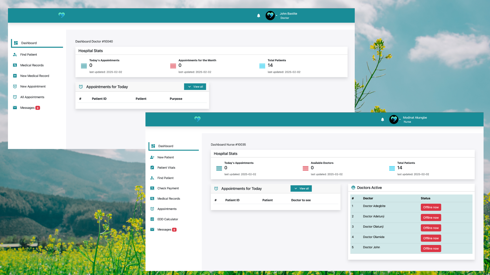

# Hospital Management App

## 📌 Introduction
A comprehensive web application for managing hospital operations, built using HTML, CSS, JavaScript, and PHP. This app provides different dashboards for various roles including Admin, Nurse, Patient, Doctor, and Accountant. The user interface (UI) is designed to be intuitive, responsive, and visually appealing for a seamless user experience.

## ✨ Admin Features
- Manage all user roles (Admin, Nurse, Patient, Doctor, Accountant).
- View overall hospital statistics.

## ✨ Nurse Features
- Manage patient records.
- View patient appointments and schedules.
- Update patient status and progress.

## ✨ Doctor Features
- View and manage patient appointments.
- Access and update patient medical records.
- Issue prescriptions and treatment plans.

